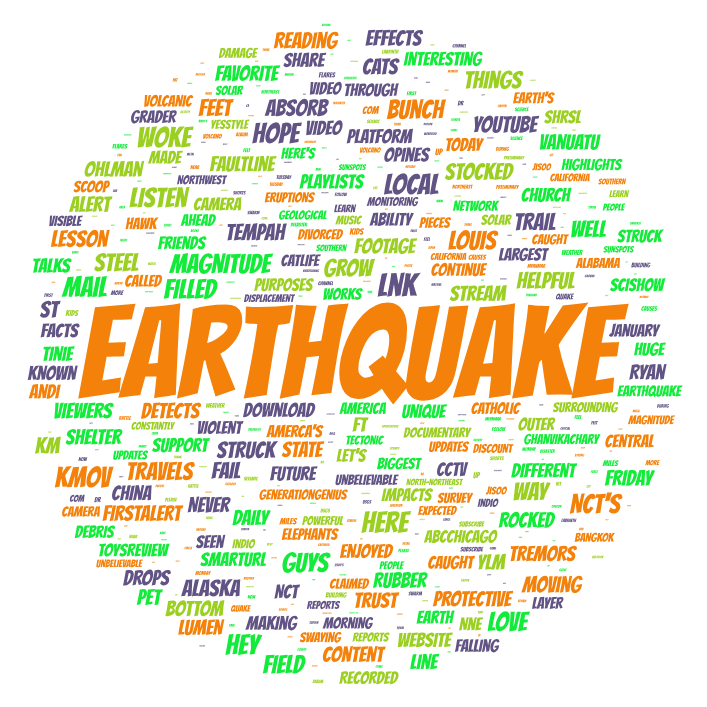
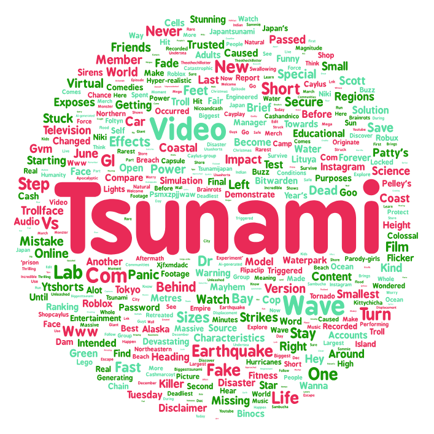

# 📊 YouTube Disaster Discourse Analysis: Tsunami vs. Earthquake

## 1. Research Topic and Search Parameters

This study collected video data from the YouTube platform using an automated data collection script, focusing on the search keywords "tsunami" and "earthquake."  Word clouds were generated based on video titles and short descriptions to visualize the content focus and linguistic characteristics of the two topics.

### Search Parameters
- **Topic 1:** `tsunami`
Search Link: `https://www.youtube.com/results?search_query=tsunami`
- **Topic 2:** `earthquake`
Search Link: `https://www.youtube.com/results?search_query=earthquake`
- **Data Collection Time:** January 2026
- **Collection Script:** Python automation script based on Selenium and BeautifulSoup
- **Collected Items:** Approximately 100 of the latest video data for each topic

---

## 2. Research Motivation
The reasons for choosing "tsunami" and "earthquake" as contrasting topics are as follows:
1. **Both belong to the category of natural disasters:** Both are typical geophysical disasters, often discussed together, but they differ in their causes, manifestations, and responses;
2. **Differences in public attention:** Earthquakes are more common, while tsunamis are mainly concentrated in coastal areas, and inland residents generally do not pay much attention to them;
3. **Potentially different media presentation:** Earthquakes focus more on early warning, rescue, and building safety, while tsunamis emphasize early warning systems, marine science, and international cooperation;
4. **Exploring semantic field differences:** Through word cloud comparison, we can reveal the linguistic preferences and cognitive frameworks of the public and media when describing these two types of disasters.

---

## 3. Word Cloud Comparison

**Figure 1. Word cloud for "Earthquake"**

**Figure 2. Word cloud for "Tsunami"**

### Comparative Analysis

#### 1. Differences in Core Thematic Vocabulary
- **Earthquake word cloud** highlights technology and measurement vocabulary: such as "Magnitude," "Tectonic," "Geological," and other professional terms.
- **Tsunami word cloud** is dominated by natural and visual vocabulary: such as "Wave," "Ocean," "Water," "Massive," and other descriptive terms.

#### 2. Differences in Media Attributes
- Both show a high frequency of "Video," but earthquake content leans more towards news reports and real-time updates.
- Tsunami content shows a stronger tendency towards entertainment, including social media and game-related vocabulary such as "Roblox," "Instagram," and "Troll."

#### 3. Differences in Regional Focus
- The earthquake word cloud prominently features regional vocabulary such as "California."
- The tsunami word cloud features "Japan" and related vocabulary prominently, indicating Japan's central role in tsunami narratives.

#### 4. Differences in Content Nature
- Earthquakes emphasize scientific monitoring and early warning: "USGS," "Reports," "Updates," "Monitoring."
- Tsunamis emphasize visual experience and impact: "Watch," "Footage," "Simulation," "Visual."

#### 5. Differences in Cultural Influence
- Earthquake content is relatively serious, containing more institutional and scientific terminology.
- Tsunami content is more deeply influenced by internet culture, featuring influencer culture vocabulary such as "Sambucha," "Buzz," and "Merch."

### Key Findings
Earthquake content exhibits more scientific and technical characteristics, while tsunami content focuses more on visual representation and online cultural dissemination. This difference reflects not only the different characteristics of the two natural disasters but also the characteristics of communication and cultural construction of different types of disasters in the social media era.

---

## 4. Possible Reasons for Observed Patterns

1. **Differences in Physical Characteristics:** Earthquakes are primarily measured by magnitude and intensity, while tsunamis are described by wave height and destructive range, which influences the use of related technical terminology.
2. **Different Propagation Characteristics:** Tsunamis have a stronger visual impact and are more likely to generate compelling video content, leading to the appearance of more visually descriptive vocabulary.
3. **Cultural and Cognitive Differences:** Japan has a mature system for tsunami preparedness, making "Japan" a key term in the tsunami word cloud; California, as an earthquake-prone region, is prominent in the earthquake word cloud.
4. **Platform Algorithm Influence:** YouTube's recommendation mechanism may have different promotion logics for different types of disaster content, affecting the frequency of related vocabulary.

---

## 5. Limitations and Future Improvements

### Limitations of the Current Study
1. **Limited sample size:** Only fewer than 100 video data points were collected for each topic, which may not fully represent the overall trend.
2. **Lack of time span:** Data collection was concentrated over a short period, without considering seasonal variations.
3. **Single language:** Only English content was analyzed, excluding users of other languages.
4. **Platform dependence:** The results are heavily influenced by YouTube's algorithms and platform characteristics.

### Future Improvement Directions
1. **Expand data scale:** Increase the number of videos collected and extend the data collection time span.
2. **Multi-platform comparison:** Compare the same content across different platforms such as YouTube, Twitter, and Facebook.
3. **Multi-language analysis:** Include analysis of content in other languages ​​such as Japanese and Chinese.
4. **Time series analysis:** Track content changes at different periods after a disaster occurs.

---

## 6. Unexpected Findings and Observations

The research findings show that tsunami-related content exhibits an unexpectedly high degree of entertainment-oriented tendencies, with a large number of game and social media-related terms appearing, reflecting the undesirable phenomenon of disaster content being sensationalized. In contrast, earthquake-related content demonstrates greater scientific and professional characteristics, with frequent appearances of institutional names and technical terms, indicating a relatively serious communication style. However, despite the frequent use of scientific terminology, in-depth scientific explanations remain limited, suggesting that science communication still faces challenges in the social media environment.

Another noteworthy phenomenon is the high concentration of regional symbols, particularly Japan's absolute dominance in tsunami-related content. This phenomenon of a specific region becoming a solidified cultural symbol representing a particular type of disaster, while reinforcing disaster memory and response experience in the relevant region, may inadvertently affect the breadth and accuracy of public perception of other risk areas globally.

---

## 7. Data Access

The datasets used in this project are available for download:

- [Download Earthquake Search Results](assets/search-result-1.csv)
- [Download Tsunami Search Results](assets/search-result-2.csv)

---
